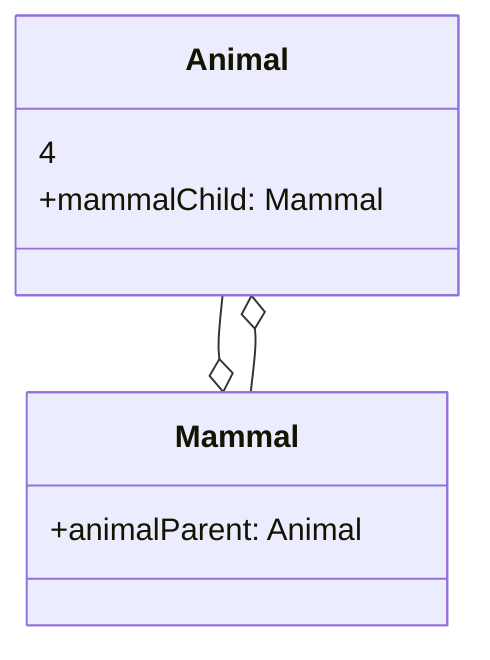

可以帮助拷贝已存在的实例而使代码不依赖于类的定义。

> 本质上就是为了提供一个.copy/.deepcopy方法。如果没有这一方法，就需要创建一个新的空对象，然后遍历旧实例的所有属性。
>
> Python中使用`copy.copy (self.__copy__)`和`copy.deepcopy (self.__deepcopy__)`实现原型模式。注意：`__deepcopy__(self, memo=None)`的memo参数用于防止递归拷贝。



上面的例子是一个存在递归拷贝的问题：拷贝`animal`会拷贝`mammalChild`，拷贝`mammalChild`时又需要拷贝`animalParent`。

```cpp
class Shape {
  public:
    int x;
    int y;
    std::string color;
    Shape(int x, int y, const std::string& color): x(x), y(y), color(color) {}
    virtual Shape* clone() const = 0;
    virtual ~Shape() {} // 具有虚函数的基类中应该提供虚析构函数，确保通过基类指针删除派生类对象时，能够调用派生类析构函数！
}

class Rectangle: public Shape {
  public:
    int width;
    int height;
    Rectangle(int x, int y, const std::string color&, int width, int height): Shape(x, y, color), width(width), height(height){}
    Rectangle* clone() override {
      return new Rectangle(*this);
    }
}

class Circle: public Shape {
  public:
    int radius;
    Circle(int x, int y, const std::string color&, int radius): Shape(x, y, color), radius(radius){}
    Circle* clone() override {
      return new Circle(*this);
    }
};

int main() {
  Circle c = Circle(10, 10, "#FFF", 5);
  Circle* pAnotherCircle = c.clone();
  delete pAnotherCirlce;
}
```

注意，cpp存在若干个特殊成员函数
- 默认构造函数：不接受任何参数，用于创建类的对象时不提供任何参数的情况
- 拷贝构造函数：接受一个对同类型对象的常量引用`const Type&`作为参数，用于创建新副本（按位的浅拷贝）
  - 在本例中，`new Circle(*this)`实际上执行了拷贝构造函数。如果存在指针字段，那就需要手动重载进行深拷贝了
- 拷贝赋值运算符，类似拷贝构造函数，只不过重载了`=`，`return *this`
- 析构函数